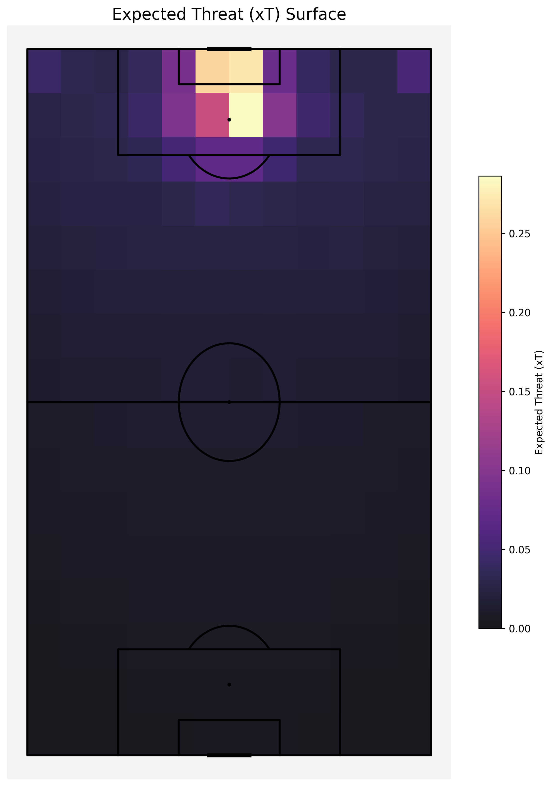

# Expected Threat (xT) Model using StatsBomb Open Data

## Overview

This project implements a location-based Expected Threat (xT) model using Python and publicly available StatsBomb open event data. xT quantifies the probability of a possession eventually leading to a goal, given the ball's location. This model calculates the xT value for different pitch zones and then determines the change in xT (`xt_added`) resulting from on-ball actions like passes, carries, and shots.

The primary goal is to evaluate player actions and identify high-value ball progressions beyond simple metrics.

**Data Source:** [StatsBomb Open Data](https://github.com/statsbomb/open-data) accessed via the [statsbombpy](https://github.com/statsbomb/statsbombpy) library.
**Current Scope:** Implemented and tested using Men's World Cup 2018 & Euro 2020 data available in the open dataset.

## Features

*   Calculates an xT value grid (16x12) representing the threat level across the pitch.
*   Determines the `xt_added` for individual passes, carries, and shots based on start/end locations and model values.
*   Generates visualizations saved to the `output_plots` directory:
    *   xT Surface Heatmap (`xt_surface_heatmap.png`)
    *   Density Heatmaps of Start/End Zones for high-xT actions (`start_end_density_heatmap.png`)
    *   Player xT Contribution Breakdown (Passes vs. Carries vs. Shots) (`player_xt_breakdown.png`)
*   Performs Exploratory Data Analysis (EDA):
    *   Ranks players by total `xt_added`.
    *   Analyzes aggregate xT contributions by action type.
    *   Attempts to extract player positions (limited by open data quality).
*   Includes framework for (currently limited by open data):
    *   Minutes played estimation for per-90 analysis.
    *   Game state (score difference) tagging.
    *   Team-level xT vs. Goals correlation checks.

## Methodology

The model follows a common approach for location-based xT:

1.  **Pitch Discretization:** The pitch (120x80 yards) is divided into a 16x12 grid.
2.  **Action Probabilities:** For each zone, the probabilities of shooting (`P(Shot|Zone)`) or moving (`P(Move|Zone)`) are calculated from event data. The probability of scoring given a shot (`P(Goal|Shot from Zone)`) is estimated using StatsBomb's provided xG.
3.  **Transition Matrix:** A transition matrix (`T_ij`) is computed, representing the probability of successfully moving from zone `i` to zone `j`.
4.  **Iterative Solver:** The xT value for each zone is calculated iteratively using a Markov chain approach until convergence:
    `xT(i)_new = P(Shoot|i)*P(Goal|Shot from i) + P(Move|i) * Σ [ T_ij * xT(j)_old ]`
5.  **Action Value:** The value added by a successful move is `xT(end_zone) - xT(start_zone)`. The value added by a shot is its `xG`.

Inspired by concepts discussed by analysts like Karun Singh and others in the football analytics community.

## Visualizations (Examples)

*(These paths assume the images are saved in the `output_plots` subdirectory)*

**xT Surface Heatmap:**


**Density of High xT Actions (Start vs End Zones):**


**Player Contribution Breakdown:**


## Setup and Installation

1.  **Clone the repository:**
    ```bash
    git clone https://github.com/Abbasali17/YOUR_REPO_NAME.git # Replace YOUR_REPO_NAME
    cd YOUR_REPO_NAME
    ```
2.  **Create a virtual environment (Recommended):**
    ```bash
    python -m venv venv
    venv\Scripts\activate  # On Windows
    # source venv/bin/activate  # On macOS/Linux
    ```
3.  **Install dependencies:**
    ```bash
    pip install -r requirements.txt
    ```

## Usage

1.  **Configure Data (Optional):** Open `xT_code.py` and modify the `COMPS_TO_LOAD` dictionary if you wish to use different available StatsBomb open datasets.
2.  **Run the script:**
    ```bash
    python xT_code.py
    ```
3.  The script will:
    *   Download necessary data using `statsbombpy` (can take time on first run).
    *   Attempt to calculate minutes played (often fails with open data).
    *   Build the xT model.
    *   Generate visualizations (displayed and saved to `output_plots/`).
    *   Print EDA results to the console.

## Data Limitations (StatsBomb Open Data)

*   **League Coverage:** Does not include recent, comprehensive data for top leagues like Premier League, La Liga, Bundesliga etc. Primarily major tournaments and selected other leagues/seasons.
*   **Data Completeness:** Crucial identifiers (like `home_team_id`, `away_team_id`) required for robust team-level analysis and score difference calculation were missing for *all* matches in the tested WC 2018 / Euro 2020 data.
*   **Lineup/Sub Data:** Information needed for accurate minutes played calculation appears inconsistent or incomplete, preventing reliable per-90 normalization.
*   **Positional Data:** Player position information in lineups was not reliably extractable for the tested competitions.
*   **Tracking Data:** Does not include player tracking (x, y coordinate) data.

## Model Limitations & Future Work

*   **Location-Based Only:** The current model's value is solely based on pitch location.
*   **No Smoothing:** Doesn't currently implement smoothing for zones with sparse data.
*   **Potential Improvements:**
    *   Implement smoothing techniques (e.g., KDE).
    *   Integrate external, reliable minutes played data if available.
    *   Acquire commercial data (StatsBomb, Opta) to overcome ID limitations and enable p90, game state, team correlation analyses.
    *   Incorporate StatsBomb 360 data (commercial license) to account for pressure, space, etc.

## License

This project is licensed under the MIT License - see the [LICENSE](LICENSE) file for details.

## Author

Abbas Ali Patel
